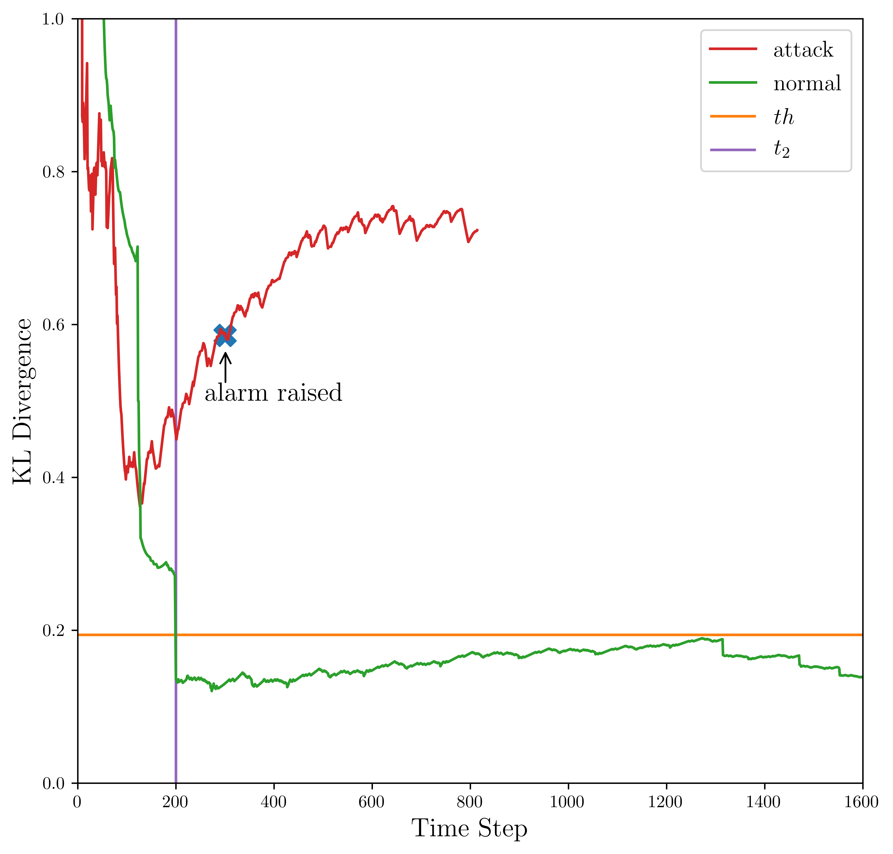

# AD<sup>3</sup>-action-distribution-divergence-detector

This repo contains the code to reproduce experiments for the detection scheme presented in *Real-time Adversarial Perturbations against Deep Reinforcement Learning Policies: Attacks and Defenses* ([arXiv report](https://arxiv.org/abs/2106.08746)). The paper will appear in the Proceedings of ESORICS 2022.

DISCLAIMER: The provided source code does NOT include experiments with the generation of universal adversarial perturbations. Usage and distribution of such code is potentially harmful and should be done separately at their authors' disclosure. In this repo we provide:

* All victim agents and the code to re-train victim agents from scratch
* The AD<sup>3</sup> algorithm 
* [visual foresight](https://arxiv.org/abs/1702.02284) modules and the code to train these modules from scratch
* One example of an adversarial mask (UAP-S and UAP-O) to evaluate defense methods.
* Please refer to the [original repository](https://github.com/chenhongge/SA_DQN) for the code and State-Adversarial DQN models used in our paper. 
* We would like to give credit to [Ilya Kostrikov](https://github.com/ikostrikov) about the implementation of A2C and PPO algorithms, you can check the original repository from [here](https://github.com/ikostrikov/pytorch-a2c-ppo-acktr-gail).

## Setup
This code has been tested to work with GPU (GeForce GTX 1060 6GB) and CUDA=10.1. We recommend using conda to run and replicate experiments smoothly. Dependencies and OpenAI baselines can be installed by following the steps below:
```
conda create -n ad3 python=3.7
conda activate ad3
pip3 install -r requirements.txt
cd src
git clone https://github.com/openai/baselines.git
cd baselines
pip3 install -e .
```
## Training DRL Agents
DQN, A2C and PPO agents are implemented for Atari 2600 Games task. We have prepared a training script that can be run by sh scripts/train.sh in order for you to generate agents with a high performance. Alternatively, you can call the python scripts directly and modify arguments by checking them from `main.py`. You can find the model saved into "output/{Game name}/{Algorithm name}/train/model.pt"<br/>

Once you have trained agents, you can deploy them in a test environment, e.g.,:
```
python  main.py  --env-name Pong --game-mode test --victim-agent-mode dqn
python  main.py  --env-name Breakout --game-mode test --victim-agent-mode ppo
python  main.py  --env-name Freeway --game-mode test --victim-agent-mode a2c --allow-early-resets True
```

<br />An Example Result on Pong DQN agents:<br />


## Licence
This project is licensed under Apache License Version 2.0. By using, reproducing or distributing to the project, you agree to the license and copyright terms therein and release your version under these terms.

## Citation
If you find our work useful in your research, you can cite the paper as follows:
```
@inproceedings{tekgul2022Ad3,
author="Tekgul, Buse G. A.
and Wang, Shelly
and Marchal, Samuel
and Asokan, N.",
title="Real-Time Adversarial Perturbations Against Deep Reinforcement Learning Policies: Attacks and Defenses",
booktitle="Computer Security -- ESORICS 2022",
year="2022",
publisher="Springer Nature Switzerland",
address="Cham",
pages="384--404",
}
```

